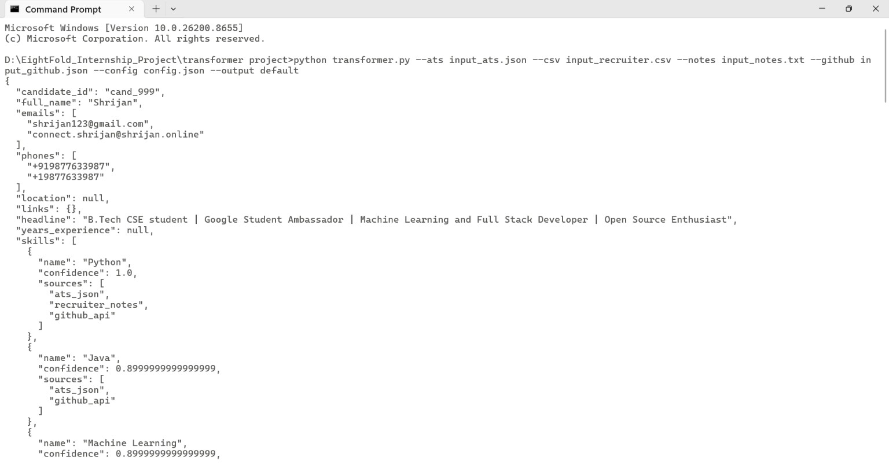
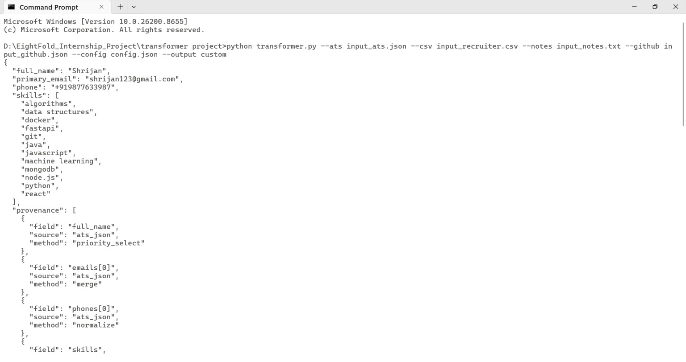
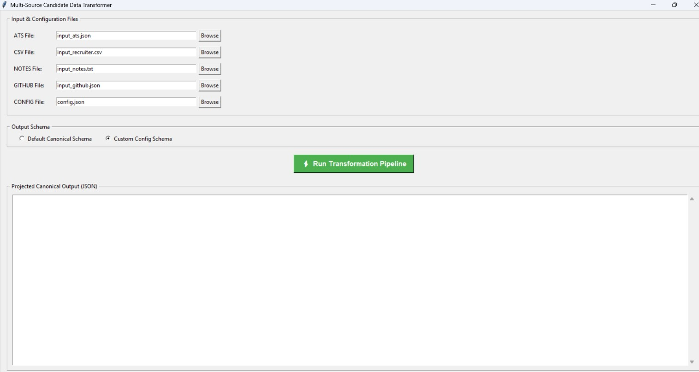
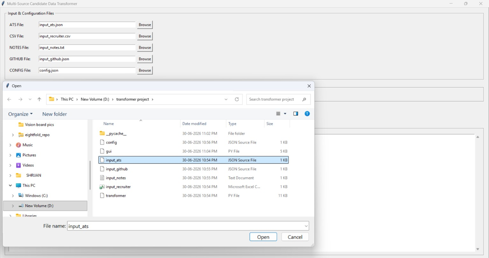
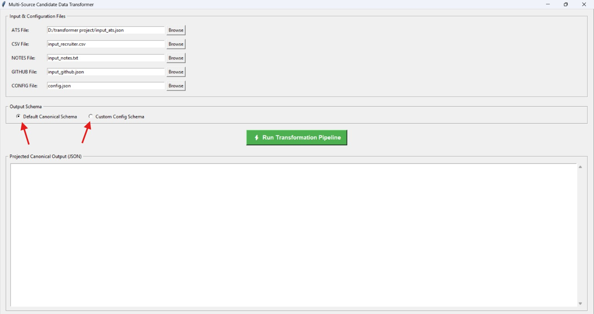
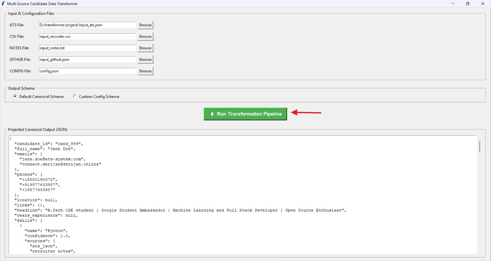
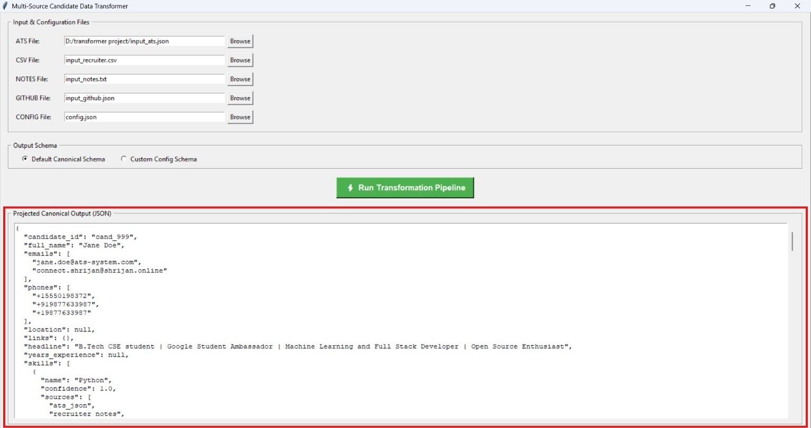

# Multi-Source Candidate Data Transformer

**Eightfold Engineering Intern Assignment (Jul–Dec 2026)**


A Python-based candidate data transformation pipeline that ingests data from multiple structured and unstructured sources, normalizes and merges them into a canonical candidate profile, and supports configurable output schemas through a runtime projection layer.

---
## Output Modes

The transformer supports two output modes:

| Mode | Description |
|------|-------------|
| **Default** | Returns the complete canonical candidate profile. |
| **Custom** | Returns a runtime-configured projection using `config.json`. |

---
## Features

- Supports multiple input sources
  - Structured
    - Recruiter CSV
    - ATS JSON
  - Unstructured
    - Recruiter Notes (.txt)
    - GitHub Profile JSON
- Canonical candidate profile generation
- Phone number normalization (E.164)
- Skill canonicalization
- Cross-source data merging
- Provenance tracking
- Overall confidence scoring
- Runtime configurable output schema
- CLI interface
- GUI interface
- Graceful handling of missing or malformed input files

---
## Technologies Used

- Python 3.10+
- Tkinter (GUI)
- JSON
- CSV
- argparse
- Regular Expressions (re)

---
## Project Structure

```
.
├── transformer.py
├── gui.py
├── config.json
│
├── input_ats.json
├── input_recruiter.csv
├── input_notes.txt
├── input_github.json
│
├── output_default.json
├── output_custom.json
│
├── Shrijan_shrijan327@gmail.com_Eightfold.pdf
└── README.md
```

---

## Canonical Pipeline

```
Input Sources
        │
        ▼
Extract
        │
        ▼
Normalize
        │
        ▼
Merge
        │
        ▼
Canonical Candidate Profile
        │
        ▼
Projection Layer (Runtime Config)
        │
        ▼
Validation
        │
        ▼
Output JSON
```

---

## Supported Input Sources

### Structured

- Recruiter CSV
- ATS JSON

### Unstructured

- Recruiter Notes (.txt)
- GitHub Profile JSON

---

## Default Canonical Output Schema

The transformer internally builds a canonical candidate profile with the following schema:

| Field | Type / Shape | Notes |
|-------|--------------|-------|
| `candidate_id` | `string` | Unique candidate identifier |
| `full_name` | `string` | Candidate's full name |
| `emails` | `string[]` | List of email addresses |
| `phones` | `string[]` | Normalized to **E.164** format |
| `location` | `{ city, region, country }` | Country follows **ISO-3166 Alpha-2** (reserved for future implementation) |
| `links` | `{ linkedin, github, portfolio, other[] }` | Candidate profile links |
| `headline` | `string \| null` | Professional headline or bio |
| `years_experience` | `number \| null` | Total years of experience |
| `skills` | `[{ name, confidence, sources[] }]` | Canonical skill names with confidence and provenance |
| `experience` | `[{ company, title, start, end, summary }]` | Work history (dates represented as `YYYY-MM` where available) |
| `education` | `[{ institution, degree, field, end_year }]` | Educational background |
| `provenance` | `[{ field, source, method }]` | Records where each value originated and how it was extracted |
| `overall_confidence` | `number` | Overall confidence score for the merged profile |

---

## Getting Started

### Prerequisites

- Python 3.10 or later
- Git (optional)

No external libraries are required. The project uses only Python's standard library.

---

### Installation

#### Step 1: Clone the Repository

```bash
git clone https://github.com/shrijan05/multi-source-candidate-data-transformer.git
cd multi-source-candidate-data-transformer
```

Or download the ZIP file from GitHub and extract it.

---

#### Step 2: Verify Project Structure

Your project folder should look like this:

```
transformer-project/
│
├── transformer.py
├── gui.py
├── config.json
│
├── input_ats.json
├── input_recruiter.csv
├── input_notes.txt
├── input_github.json
│
├── output_default.json
├── output_custom.json
│
├── README.md
└── Shrijan_shrijan327@gmail.com_Eightfold.pdf
```

---

#### Step 3: Open Terminal

Open a terminal in the project folder.

Example (Windows):

```bash
cd D:\EightFold_Internship_Project\transformer project
```

---

### Running from Command Line (CLI)

#### Default Canonical Output

Run:

```bash
python transformer.py --ats input_ats.json --csv input_recruiter.csv --notes input_notes.txt --github input_github.json --config config.json --output default
```

Expected Result

- Canonical profile printed in terminal
- `output_default.json` generated

##### Screenshot



#### Custom Config Output

Run:

```bash
python transformer.py --ats input_ats.json --csv input_recruiter.csv --notes input_notes.txt --github input_github.json --config config.json --output custom
```

Expected Result

- Custom config printed in terminal
- `output_config.json` generated

##### Screenshot



---

### Running the GUI

Start the GUI:

```bash
python gui.py
```

---

#### Step 1

The application opens.

##### Screenshot



---

#### Step 2

Verify the input files:

- ATS JSON
- Recruiter CSV
- Recruiter Notes
- GitHub JSON
- Config JSON

Or browse and select different files.

##### Screenshot



---

#### Step 3

Choose the output schema.

Options:

- Default Canonical Schema
- Custom Config Schema

##### Screenshot



---

#### Step 4

Click

```
Run Transformation Pipeline
```

##### Screenshot



---

#### Step 5

The generated JSON is displayed.

Depending on the selected option:

Default

```
output_default.json
```

or

Custom

```
output_custom.json
```

is automatically saved.

##### Screenshot



---

## Generated Outputs

After execution:

```
output_default.json
```

or

```
output_custom.json
```

will be created in the project directory.

---

## Sample Inputs

The repository already includes sample input files:

```
input_ats.json
input_recruiter.csv
input_notes.txt
input_github.json
config.json
```

No additional setup is required.

---
## Configurable Output Schema

The same transformation engine supports different output schemas using `config.json`.

Supported features:

- Select output fields
- Rename fields
- Field mapping using `from`
- Phone normalization
- Skill canonicalization
- Missing value handling
- Confidence inclusion

No code changes are required to generate different output schemas.

---


## Normalization

### Phone Numbers

Converted into E.164 format.

Example

```
555-019-8372
```

↓

```
+15550198372
```

---

### Skills

Skills are

- trimmed
- lowercased
- deduplicated

Example

```
Python
python
 PYTHON
```

↓

```
python
```

---

## Merge Strategy

The transformer merges information from all available sources.

Current priority:

```
ATS JSON
↓

Recruiter CSV
↓

Recruiter Notes

↓

GitHub
```

Scalar fields keep the highest-priority value.

Lists such as:

- emails
- phones
- skills

are merged and deduplicated.

---

## Provenance

Every extracted value stores:

- field
- source
- extraction method

Example

```json
{
    "field": "phones[0]",
    "source": "ats_json",
    "method": "normalize"
}
```

---

## Confidence

Each candidate profile receives an overall confidence score based on successfully merged information from multiple sources.

---

## Error Handling

The pipeline is resilient to:

- Missing files
- Malformed JSON
- Invalid CSV
- Missing fields

Errors are reported without crashing the application.

---

## Assumptions

- Phone numbers are normalized using a best-effort E.164 strategy.
- Skills are canonicalized by lowercasing and deduplication.
- GitHub data is provided as JSON rather than fetched live.
- Candidate matching assumes all provided sources belong to the same candidate.

---

## Future Improvements

- Resume PDF/DOCX parser
- Live GitHub API integration
- LinkedIn integration
- Country-aware phone normalization
- Advanced conflict resolution
- Fuzzy candidate matching
- Unit tests
- REST API deployment

---

## Design Decisions

- Internal canonical model is separated from the projection layer.
- Provenance is maintained for every merged field.
- The pipeline is deterministic and produces the same output for identical inputs.
- Missing or malformed sources never terminate the pipeline.

---
## Repository Contents

- Source Code
- Technical Design PDF
- Sample Input Files
- Generated Output Files
- README

---
## Author

**Shrijan**

Eightfold Engineering Intern Assignment (Jul–Dec 2026)